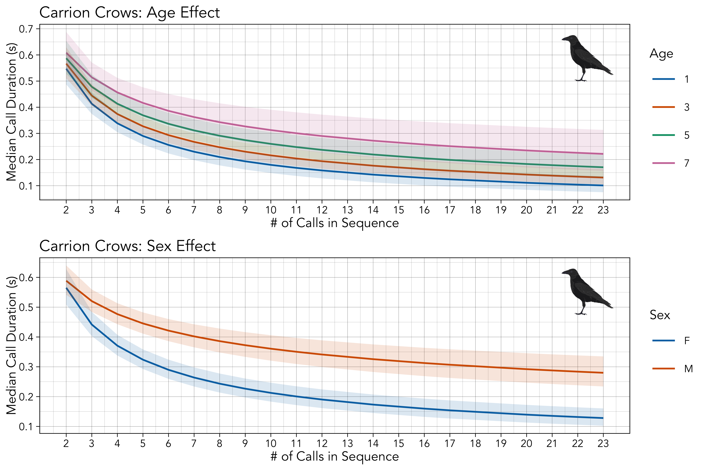

<br>
&copy; Claudia Wascher

# Links {-}

* [GitHub repository](https://github.com/masonyoungblood/crow_efficiency)

# Data {-}

Set working directory and load data.

```{r, message = FALSE, warning = FALSE}
setwd("~/Documents/Work/Spring_2025/Corvid Efficiency/crow_efficiency/docs")
data <- read.csv("data/sequences.csv")
demo <- read.csv("data/demographics.csv")

data <- data[-which(data$length < 2), ]
data <- data.frame(individual = data$individual,
                   sequence_id = as.numeric(factor(paste0(data$filename, data$sequence_id))),
                   duration = data$duration,
                   length = data$length,
                   date = as.Date(data$date, format = "%d.%m.%y"),
                   sex = demo$sex[match(data$individual, demo$name)],
                   species = demo$species[match(data$individual, demo$name)],
                   population = demo$population[match(data$individual, demo$name)],
                   group = tolower(data$Group),
                   group_size = data$Groupsize,
                   birth_year = as.numeric(demo$birth[match(data$individual, demo$name)]),
                   age = as.numeric(paste0(20, substr(data$date, 7, 8))) - as.numeric(demo$birth[match(data$individual, demo$name)]),
                   elo_rating = demo$elo_rating[match(data$individual, demo$name)],
                   csi = demo$csi[match(data$individual, demo$name)])
data$age[which(is.na(data$age))] <- mean(data$age, na.rm = TRUE)

avg_data <- aggregate(duration ~ sequence_id + length + species + sex, data = data, FUN = median)
```

Print structure of the data.

```{r, message = FALSE, warning = FALSE}
library(knitr)
library(dplyr)
library(stringr)

summary <- data %>%
  group_by(individual, group) %>%
  summarize(
    recording_duration_s = sum(duration, na.rm = TRUE),
    dates = paste0(min(date), " to ", max(date)),
    Vocalizations = n(),
    Sequences = n_distinct(sequence_id),
    .groups = "drop"
  ) %>%
  left_join(data %>% select(individual, birth_year, species, sex, population) %>% distinct(), by = "individual") %>%
  arrange(individual, group)

summary$individual <- str_to_title(summary$individual)
summary$species <- str_to_title(summary$species)
summary$sex <- str_to_title(summary$sex)
summary$population <- str_to_title(summary$population)
summary$group <- str_to_title(summary$group)

summary$recording_duration_s <- as.character(round(summary$recording_duration_s, 1))

colnames(summary) <- c(
  "Individual", "Group", "Recording Time (s)", "Dates", "# Calls", "# Sequences",
  "Birth Year", "Species", "Sex", "Population"
)

kable(summary, format = "markdown")
```

# Models {-}

Run and save all models.

```{r, eval = FALSE, message = FALSE, warning = FALSE}
carrion_menz_model <- lme4::lmer(scale(log(duration)) ~ scale(log(length)) + (1|individual/sequence_id), data = data[which(data$species == "carrion"), ])
hooded_menz_model <- lme4::lmer(scale(log(duration)) ~ scale(log(length)) + (1|individual/sequence_id), data = data[which(data$species == "hooded"), ])
hybrid_menz_model <- lme4::lmer(scale(log(duration)) ~ scale(log(length)) + (1|individual/sequence_id), data = data[which(data$species == "hybrid"), ])

menz_models <- list(carrion = carrion_menz_model, hooded = hooded_menz_model, hybrid = hybrid_menz_model)
save(menz_models, file = "models/menz_models.RData")
```

```{r, eval = FALSE, message = FALSE, warning = FALSE}
carrion_m_model <- lme4::lmer(scale(log(duration)) ~ scale(log(length)) + (1|individual/sequence_id), data = data[which(data$species == "carrion" & data$sex == "m"), ])
carrion_f_model <- lme4::lmer(scale(log(duration)) ~ scale(log(length)) + (1|individual/sequence_id), data = data[which(data$species == "carrion" & data$sex == "f"), ])

sex_models <- list(m = carrion_m_model, f = carrion_f_model)
save(sex_models, file = "models/sex_models.RData")
```

```{r, eval = FALSE, message = FALSE, warning = FALSE}
#https://blasbenito.github.io/collinear/articles/how_it_works.html
collinear::collinear(df = data, response = "duration", predictors = c("length", "sex", "group_size", "age", "elo_rating", "csi"), max_cor = NULL, max_vif = 5)
```

```{r, eval = FALSE, message = FALSE, warning = FALSE}
model_all_a <- lme4::lmer(scale(log(duration)) ~ 
                            scale(log(length)) + sex + scale(group_size) + scale(age) + scale(elo_rating) + scale(csi) + 
                            (1|population/group/individual/sequence_id),
                          data = data[which(data$species == "carrion"), ])
model_all_b <- lme4::lmer(scale(log(duration)) ~ 
                            scale(log(length))*(sex + scale(group_size) + scale(age) + scale(elo_rating) + scale(csi)) + 
                            (1|population/group/individual/sequence_id),
                          data = data[which(data$species == "carrion"), ])
model_all_c <- lme4::lmer(scale(log(duration)) ~ 
                            scale(log(length))*(sex + scale(group_size) + scale(age) + scale(elo_rating) + scale(csi)) +
                            (1|population/group/individual/sequence_id) + (0 + scale(log(length))|population:group:individual),
                          data = data[which(data$species == "carrion"), ])

ind_var_models <- list(base = model_all_a, inter_a = model_all_b, inter_b = model_all_c)
save(ind_var_models, file = "models/ind_var_models.RData")
```

Load models.

```{r, echo = FALSE, eval = TRUE, message = FALSE, warning = FALSE}
load(file = "models/menz_models.RData")
load(file = "models/sex_models.RData")
load(file = "models/ind_var_models.RData")
```

# Menzerath's Law {-}

Plot and assess Menzerath's law.

```{r, eval = FALSE, message = FALSE, warning = FALSE}
#load libraries
library(ggplot2)
library(rphylopic)

#img_coords: x, y, height
menz_plot <- function(data, avg_data, intercept, effect, bounds, color = "black", alpha = 1, effects_panel = 0.15, limits, title){
  #get original scaling from data
  og_scaled_x <- scale(log(data$length))
  og_scaled_y <- scale(log(data$duration))
  
  #function that predicts durations from lengths, based on intercepts, effects, and means and sds from scaling
  pred_durations <- function(intercept, effect, length, mean_log_length, sd_log_length, mean_log_dur, sd_log_dur){
    return(exp((intercept + effect*((log(length) - mean_log_length)/sd_log_length))*sd_log_dur + mean_log_dur))
  }
  
  #compute best fit line for plotting
  best_fit_data <- data.frame(x = seq(from = min(avg_data$length), to = max(avg_data$length), length.out = 1000))
  best_fit_data$y <- pred_durations(intercept, effect, length = best_fit_data$x,
                                    mean_log_length = attr(og_scaled_x, "scaled:center"), sd_log_length = attr(og_scaled_x, "scaled:scale"),
                                    mean_log_dur = attr(og_scaled_y, "scaled:center"), sd_log_dur = attr(og_scaled_y, "scaled:scale"))
  
  #get summary stats for titles
  n_inds <- format(length(unique(data$individual)), big.mark = ",", scientific = FALSE)
  n_seqs <- format(length(unique(data$sequence_id)), big.mark = ",", scientific = FALSE)
  n_calls <- format(nrow(data), big.mark = ",", scientific = FALSE)
  
  #construct base plot
  base_plot <- ggplot(avg_data, aes(x = length, y = duration)) + 
    geom_jitter(colour = color, size = 1, stroke = 0, height = 0, width = 0.1) + 
    geom_line(data = best_fit_data, aes(x = x, y = y), colour = color, linewidth = 0.5) +
    theme_linedraw(base_size = 8, base_family = "Avenir") +
    scale_x_continuous(breaks = 2:max(avg_data$length)) + 
    scale_y_continuous(breaks = scales::pretty_breaks(n = 6)) + 
    ggtitle(paste0(title, " (", n_inds, " Birds, ", n_calls, " Calls, ", n_seqs, " Sequences)")) + 
    xlab("# of Calls in Sequence") + ylab("Median Call Duration (s)")
  
  #construct effects plot
  effects_plot <- ggplot() + 
    geom_point(aes(x = 1, y = effect), stroke = 1, colour = color) + 
    geom_linerange(aes(x = 1, ymin = bounds[1], ymax = bounds[2]), colour = color) + 
    theme_linedraw(base_size = 8, base_family = "Avenir") + 
    geom_hline(yintercept = 0, lty = "dashed") + 
    scale_y_continuous(name = "Slope", position = "right", labels = scales::number_format(accuracy = 0.1), breaks = scales::pretty_breaks(n = 6), limits = limits) + 
    scale_x_continuous(name = "...", breaks = c(1), labels = c("A"), limits = c(0.5, 1.5)) + 
    ggtitle(" ") + 
    theme(panel.grid.major.x = element_blank(), panel.grid.minor.x = element_blank(), 
          axis.ticks.x = element_blank(),
          legend.position = "none",
          axis.title.x = element_text(colour = "white"),
          axis.text.x = element_text(colour = "white"))
  
  #combine and return
  return(cowplot::plot_grid(base_plot, effects_plot, rel_widths = c(1, effects_panel)))
}

#combined plot
png("plots/combined_plot.png", width = 6, height = 6, units = "in", res = 600)
cowplot::plot_grid(
  menz_plot(data[which(data$species == "carrion"), ], avg_data = avg_data[which(avg_data$species == "carrion"), ],
            intercept = summary(menz_models$carrion)$coefficients[1, 1],
            effect = summary(menz_models$carrion)$coefficients[2, 1], limits = c(-0.65, 0.1), title = "Carrion Crows",
            bounds = as.numeric(confint(menz_models$carrion, method = "Wald", parm = "scale(log(length))")), color = "black") +
  cowplot::draw_image("imgs/Carrion_crow.png", 
                      x = 0.7, y = 0.65, height = 0.2, width = 0.2),
  menz_plot(data[which(data$species == "hooded"), ], avg_data = avg_data[which(avg_data$species == "hooded"), ],
            intercept = summary(menz_models$hooded)$coefficients[1, 1],
            effect = summary(menz_models$hooded)$coefficients[2, 1], limits = c(-0.65, 0.1), title = "Hooded Crows",
            bounds = as.numeric(confint(menz_models$hooded, method = "Wald", parm = "scale(log(length))")), color = "black") +
  cowplot::draw_image("imgs/Hooded_crow.png", 
                      x = 0.7, y = 0.65, height = 0.2, width = 0.2),
  menz_plot(data[which(data$species == "hybrid"), ], avg_data = avg_data[which(avg_data$species == "hybrid"), ],
            intercept = summary(menz_models$hybrid)$coefficients[1, 1],
            effect = summary(menz_models$hybrid)$coefficients[2, 1], limits = c(-0.65, 0.1), title = "Hybrid Crows",
            bounds = as.numeric(confint(menz_models$hybrid, method = "Wald", parm = "scale(log(length))")), color = "black") +
  cowplot::draw_image("imgs/Carrion_crow.png", 
                      x = 0.63, y = 0.65, height = 0.2, width = 0.2) + 
  cowplot::draw_image("imgs/Hooded_crow.png", 
                      x = 0.7, y = 0.65, height = 0.2, width = 0.2),
  nrow = 3)
invisible(dev.off())

#sex plot
png("plots/sex_plot.png", width = 6, height = 4, units = "in", res = 600)
cowplot::plot_grid(
  menz_plot(data[which(data$species == "carrion" & data$sex == "f"), ], avg_data = avg_data[which(avg_data$species == "carrion" & avg_data$sex == "f"), ],
            intercept = summary(sex_models$f)$coefficients[1, 1],
            effect = summary(sex_models$f)$coefficients[2, 1], limits = c(-0.65, 0.1), title = "Female Carrion Crows",
            bounds = as.numeric(confint(sex_models$f, method = "Wald", parm = "scale(log(length))")), color = "black") +
  cowplot::draw_image("imgs/female.png", 
                    x = 0.67, y = 0.69, height = 0.14, width = 0.14) + 
  cowplot::draw_image("imgs/Carrion_crow.png", 
                      x = 0.7, y = 0.65, height = 0.2, width = 0.2),
  menz_plot(data[which(data$species == "carrion" & data$sex == "m"), ], avg_data = avg_data[which(avg_data$species == "carrion" & avg_data$sex == "m"), ],
            intercept = summary(sex_models$m)$coefficients[1, 1],
            effect = summary(sex_models$m)$coefficients[2, 1], limits = c(-0.65, 0.1), title = "Male Carrion Crows",
            bounds = as.numeric(confint(sex_models$m, method = "Wald", parm = "scale(log(length))")), color = "black") +
  cowplot::draw_image("imgs/male.png", 
                      x = 0.67, y = 0.69, height = 0.12, width = 0.12) + 
  cowplot::draw_image("imgs/Carrion_crow.png", 
                      x = 0.7, y = 0.65, height = 0.2, width = 0.2),
  nrow = 2)
invisible(dev.off())
```

```{r combined-plot, message = FALSE, warning = FALSE, echo = FALSE, fig.align = "center", out.width = "80%", fig.cap = "The distribution of element durations and sequence lengths (left) and the slope of Menzerath's law (right), for each of the three crow species. The bars in the slope plot (right) mark the 95% confidence intervals around the point estimates."}
knitr::include_graphics("plots/combined_plot.png")
```

```{r table-carrion, echo = FALSE}
menz_table_carrion <- as.data.frame(summary(menz_models$carrion)$coefficients)
menz_table_carrion <- cbind(menz_table_carrion$Estimate, as.data.frame(confint(menz_models$carrion, method = "Wald", parm = c("(Intercept)", "scale(log(length))"))))
menz_table_carrion <- round(menz_table_carrion, 3)
menz_table_carrion <- cbind(c("Intercept", "Length"), menz_table_carrion, sapply(1:nrow(menz_table_carrion), function(x){ifelse(menz_table_carrion[x, 2]*menz_table_carrion[x, 3] > 0, "*", "")}))
colnames(menz_table_carrion) <- c("Parameter", "Estimate", "2.5% (Lower)", "97.5% (Upper)", " ")
flextable::flextable(menz_table_carrion) %>% 
  flextable::set_caption("Menzerath's law in carrion crows.", autonum = officer::run_autonum()) %>%
  flextable::theme_vanilla() %>% flextable::set_table_properties(layout = "autofit")
```

```{r table-hooded, echo = FALSE}
menz_table_hooded <- as.data.frame(summary(menz_models$hooded)$coefficients)
menz_table_hooded <- cbind(menz_table_hooded$Estimate, as.data.frame(confint(menz_models$hooded, method = "Wald", parm = c("(Intercept)", "scale(log(length))"))))
menz_table_hooded <- round(menz_table_hooded, 3)
menz_table_hooded <- cbind(c("Intercept", "Length"), menz_table_hooded, sapply(1:nrow(menz_table_hooded), function(x){ifelse(menz_table_hooded[x, 2]*menz_table_hooded[x, 3] > 0, "*", "")}))
colnames(menz_table_hooded) <- c("Parameter", "Estimate", "2.5% (Lower)", "97.5% (Upper)", " ")
flextable::flextable(menz_table_hooded) %>% 
  flextable::set_caption("Menzerath's law in hooded crows.", autonum = officer::run_autonum()) %>%
  flextable::theme_vanilla() %>% flextable::set_table_properties(layout = "autofit")
```

```{r table-hybrid, echo = FALSE}
menz_table_hybrid <- as.data.frame(summary(menz_models$hybrid)$coefficients)
menz_table_hybrid <- cbind(menz_table_hybrid$Estimate, as.data.frame(confint(menz_models$hybrid, method = "Wald", parm = c("(Intercept)", "scale(log(length))"))))
menz_table_hybrid <- round(menz_table_hybrid, 3)
menz_table_hybrid <- cbind(c("Intercept", "Length"), menz_table_hybrid, sapply(1:nrow(menz_table_hybrid), function(x){ifelse(menz_table_hybrid[x, 2]*menz_table_hybrid[x, 3] > 0, "*", "")}))
colnames(menz_table_hybrid) <- c("Parameter", "Estimate", "2.5% (Lower)", "97.5% (Upper)", " ")
flextable::flextable(menz_table_hybrid) %>% 
  flextable::set_caption("Menzerath's law in hybrid crows.", autonum = officer::run_autonum()) %>%
  flextable::theme_vanilla() %>% flextable::set_table_properties(layout = "autofit")
```

# Individual Variation {-}

Investigate individual variation, including plots of interaction effects.

```{r, eval = FALSE, message = FALSE, warning = FALSE}
#load libraries
library(ggeffects)
library(ggplot2)

#get marginal predictions for different ages
predictions <- ggpredict(ind_var_models$inter_b, c("length", "age [1, 3, 5, 7]"), back_transform = FALSE)
predictions$predicted <- exp((predictions$predicted*sd(log(data$duration))) + mean(log(data$duration)))
predictions$conf.low <- exp((predictions$conf.low*sd(log(data$duration))) + mean(log(data$duration)))
predictions$conf.high <- exp((predictions$conf.high*sd(log(data$duration))) + mean(log(data$duration)))

#construct age effect plot
age_effect <- predictions %>% plot(line_size = 0.5)
colors <- c("#0072B2", "#D55E00", "#009E73", "#CC79A7", "#BDB10F", "#38A6E5", "#E09900")
age_effect <- age_effect + 
  ggtitle("Carrion Crows: Age Effect") + 
  scale_colour_manual(values = colors[1:4]) + 
  scale_fill_manual(values = colors[1:4]) + 
  scale_x_continuous(breaks = 2:max(avg_data$length)) + 
  scale_y_continuous(breaks = scales::pretty_breaks(n = 6)) + 
  labs(colour = "Age") + xlab("# of Calls in Sequence") + ylab("Median Call Duration (s)") + 
  theme_linedraw(base_size = 8, base_family = "Avenir")
age_effect$layers[[2]]$show.legend <- FALSE
age_effect$layers[[1]]$aes_params$linewidth <- 0.5

#get marginal predictions for different sexes
predictions <- ggpredict(ind_var_models$inter_b, c("length", "sex"), back_transform = FALSE)
predictions$predicted <- exp((predictions$predicted*sd(log(data$duration))) + mean(log(data$duration)))
predictions$conf.low <- exp((predictions$conf.low*sd(log(data$duration))) + mean(log(data$duration)))
predictions$conf.high <- exp((predictions$conf.high*sd(log(data$duration))) + mean(log(data$duration)))

#construct age effect plot
sex_effect <- predictions %>% plot(line_size = 0.5)
colors <- c("#0072B2", "#D55E00", "#009E73", "#CC79A7", "#BDB10F", "#38A6E5", "#E09900")
sex_effect <- sex_effect + 
  ggtitle("Carrion Crows: Sex Effect") + 
  scale_colour_manual(values = colors[1:2], labels = c("F", "M")) + 
  scale_fill_manual(values = colors[1:2], labels = c("F", "M")) + 
  scale_x_continuous(breaks = 2:max(avg_data$length)) + 
  scale_y_continuous(breaks = scales::pretty_breaks(n = 6)) +
  labs(colour = "Sex") + xlab("# of Calls in Sequence") + ylab("Median Call Duration (s)") + 
  theme_linedraw(base_size = 8, base_family = "Avenir")
sex_effect$layers[[2]]$show.legend <- FALSE
sex_effect$layers[[1]]$aes_params$linewidth <- 0.5

#save plot
png("plots/interact_plot.png", width = 6, height = 4, units = "in", res = 600)
cowplot::plot_grid(
  cowplot::plot_grid(age_effect, ggplot(NULL) + theme_void(), rel_widths = c(1, 0)) + cowplot::draw_image("imgs/Carrion_crow.png", x = 0.737, y = 0.65, height = 0.2, width = 0.2),
  cowplot::plot_grid(sex_effect, ggplot(NULL) + theme_void(), rel_widths = c(1, 0)) + cowplot::draw_image("imgs/Carrion_crow.png", x = 0.737, y = 0.65, height = 0.2, width = 0.2),
  nrow = 2
)
invisible(dev.off())
```

```{r ind-var, message = FALSE, warning = FALSE}
aic_table <- as.data.frame(AIC(ind_var_models$base, ind_var_models$inter_a, ind_var_models$inter_b))
aic_table$AIC <- round(aic_table$AIC)
aic_table <- cbind(Model = c("No Interactions", "Simple Interactions", "Complex Interactions"), aic_table)
flextable::flextable(aic_table) %>% 
  flextable::set_caption("Comparison of models of individual variation.", autonum = officer::run_autonum()) %>%
  flextable::theme_vanilla() %>% flextable::set_table_properties(layout = "autofit")
```

```{r lrt, message = FALSE, warning = FALSE}
p_values <- c(anova(ind_var_models$base, ind_var_models$inter_a)$`Pr(>Chisq)`[2], anova(ind_var_models$inter_a, ind_var_models$inter_b)$`Pr(>Chisq)`[2])
p_values
```

```{r ind-var-table, message = FALSE, warning = FALSE}
ind_var_table <- as.data.frame(summary(ind_var_models$inter_b)$coefficients)
ind_var_table <- cbind(ind_var_table$Estimate, as.data.frame(confint(ind_var_models$inter_b, method = "Wald", parm = c(7:18))))
ind_var_table <- round(ind_var_table, 3)
ind_var_table <- cbind(c("Intercept", "Length", "Sex (M vs. F)", "Group Size", "Age", "ELO", "CSI", "Length : Sex (M vs. F)", "Length : Group Size", "Length : Age", "Length : ELO", "Length : CSI"), ind_var_table, sapply(1:nrow(ind_var_table), function(x){ifelse(ind_var_table[x, 2]*ind_var_table[x, 3] > 0, "*", "")}))
colnames(ind_var_table) <- c("Parameter", "Estimate", "2.5% (Lower)", "97.5% (Upper)", " ")
flextable::flextable(ind_var_table) %>% 
  flextable::set_caption("Individual variation in Menzerath's law in carrion crows.", autonum = officer::run_autonum()) %>%
  flextable::theme_vanilla() %>% flextable::set_table_properties(layout = "autofit")
```

```{r sex-plot, message = FALSE, warning = FALSE, echo = FALSE, fig.align = "center", out.width = "80%", fig.cap = "The distribution of element durations and sequence lengths (left) and the slope of Menzerath's law (right), for female and male carrion crows. The bars in the slope plot (right) mark the 95% confidence intervals around the point estimates."}

```

```{r interact-plot, message = FALSE, warning = FALSE, echo = FALSE, fig.align = "center", out.width = "80%", fig.cap = "The predicted relationship between element durations and sequence lengths for different levels of age (top) and sex (bottom), from the fitted version of INSERT MODEL."}

```
